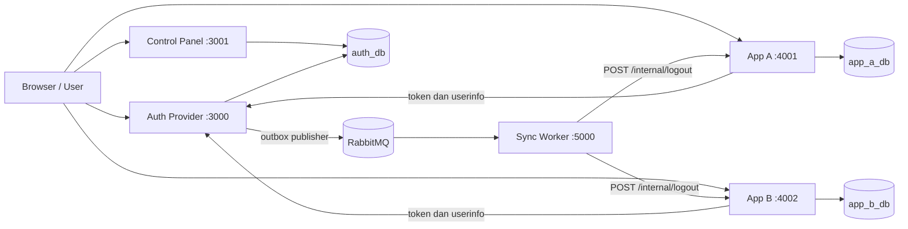
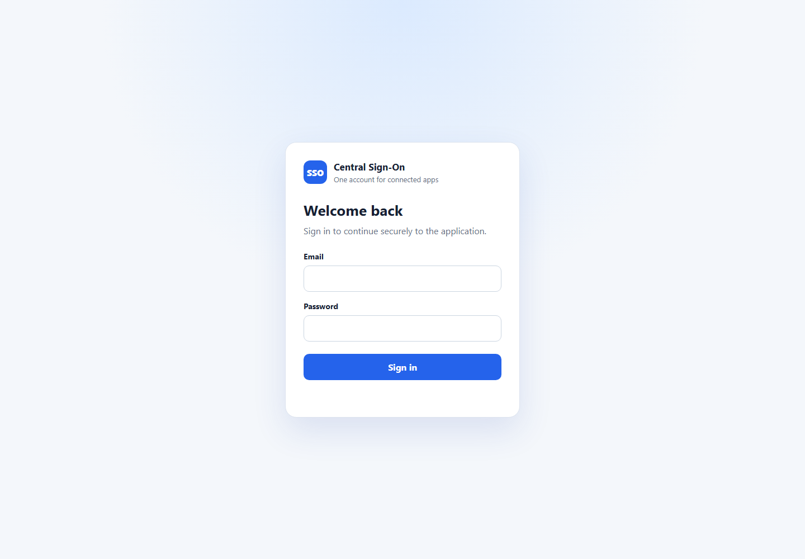
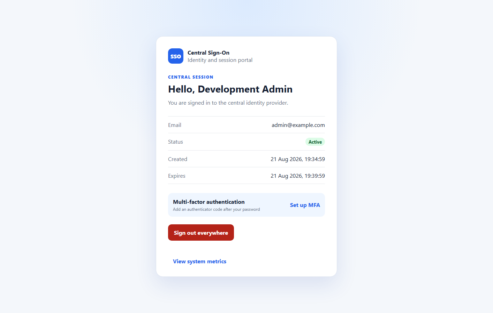
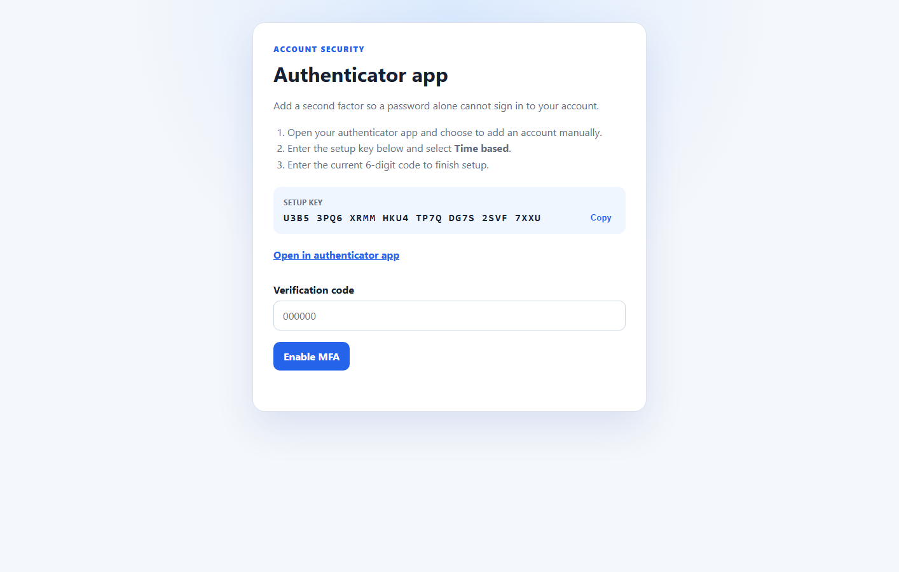
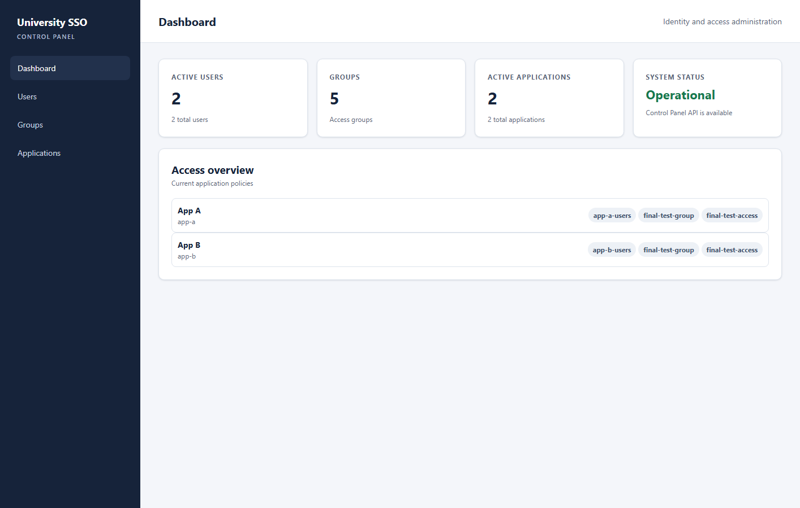
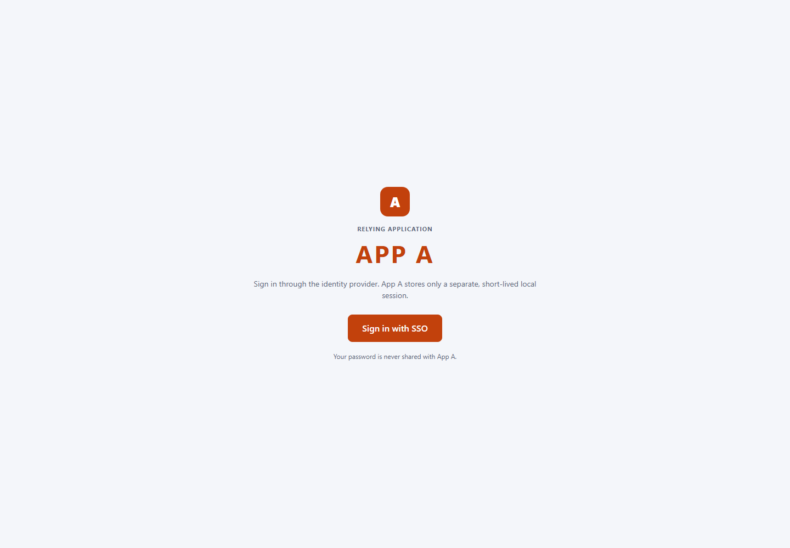
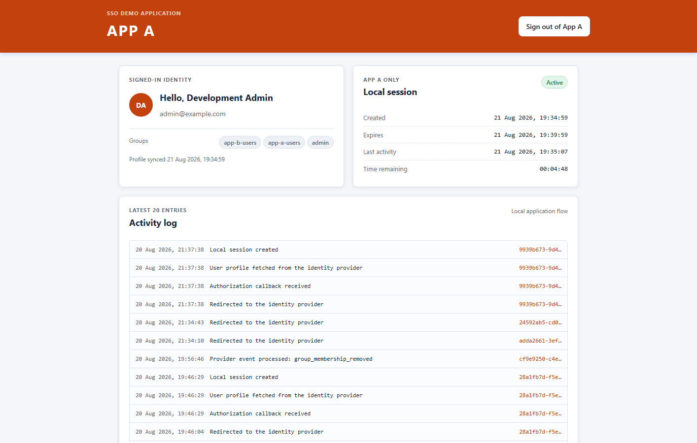
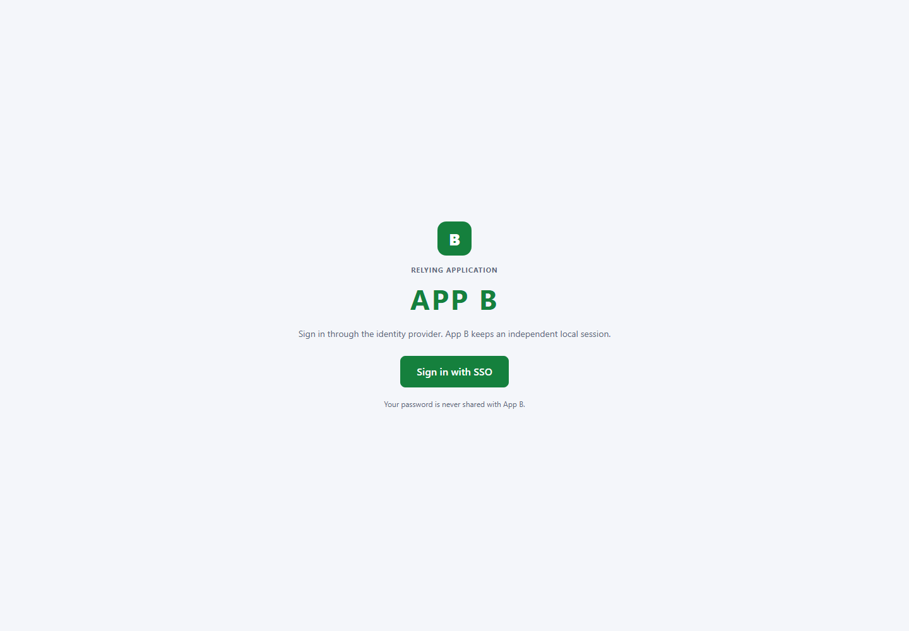
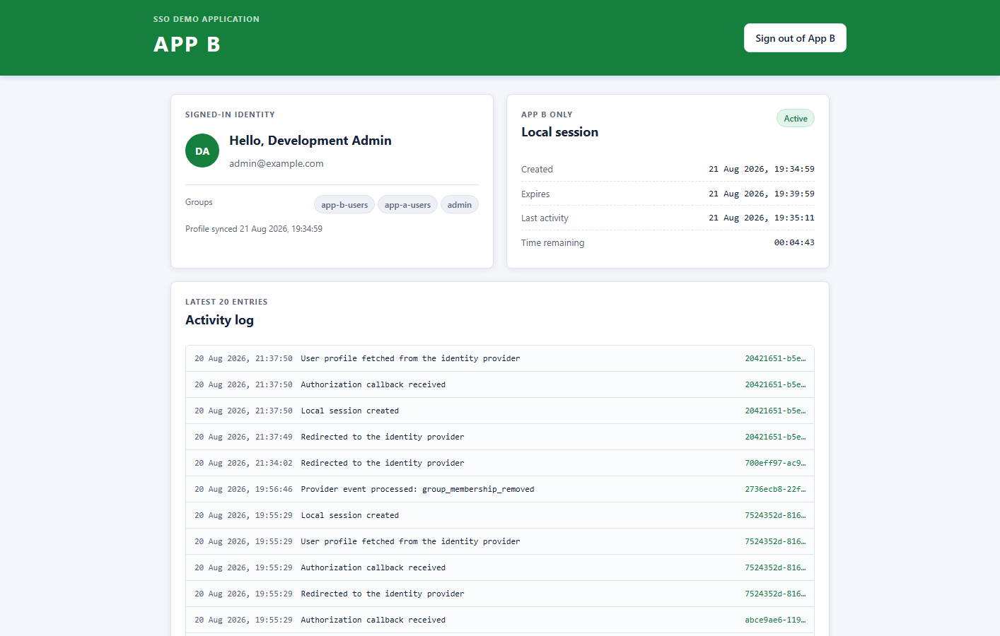
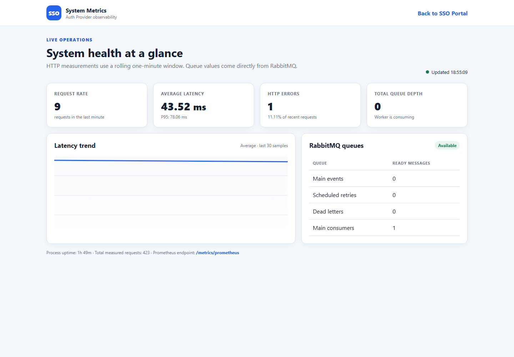

# Auth Provider Platform

> Platform Single Sign-On berbasis OAuth 2.0 Authorization Code Flow dengan PKCE, central session, dan asynchronous session revocation.

Proyek ini terdiri atas Auth Provider sebagai pusat identitas, Control Panel untuk administrasi, dua relying application, serta Sync Worker yang menyampaikan pencabutan sesi melalui message broker. Seluruh komponen berada dalam satu monorepo dan dapat dijalankan dengan satu perintah Docker Compose.

## Identitas

| | |
|---|---|
| Nama | Gabriella Botimada Lubis |
| NIM | 13524006 |

## Daftar Isi

- [Ringkasan Fitur](#ringkasan-fitur)
- [Tech Stack](#tech-stack)
- [Arsitektur Sistem](#arsitektur-sistem)
- [Alur Utama](#alur-utama)
- [Keputusan Teknis](#keputusan-teknis)
- [Menjalankan Sistem](#menjalankan-sistem)
- [Environment Variables](#environment-variables)
- [API Endpoints](#api-endpoints)
- [Project Structure](#project-structure)
- [Testing](#testing)
- [Bonus](#bonus)
- [Screenshots](#screenshots)
- [Security Notes](#security-notes)

## Ringkasan Fitur

- Login terpusat dan SSO untuk App A dan App B.
- OAuth 2.0 Authorization Code Flow dengan PKCE S256, `state`, exact redirect URI matching, authorization code sekali pakai, dan opaque access token.
- Central session pada Auth Provider dan local session terpisah pada setiap aplikasi.
- Control Panel khusus anggota grup `admin` untuk mengelola user, group, application, dan access policy.
- Perubahan password, penonaktifan user, perubahan policy, dan global logout dapat mencabut sesi terkait.
- Transactional outbox, RabbitMQ, retry exponential, Dead-Letter Queue (DLQ), dan pemrosesan event idempotent.
- Audit log, activity log, validasi request, serta format error yang konsisten.
- Migration dan seed otomatis ketika stack dinyalakan.
- Bonus MFA TOTP, observability, liveness/readiness probe, dan graceful shutdown.

## Tech Stack

| Bagian | Teknologi | Versi |
|---|---|---:|
| Bahasa | TypeScript | 5.7.3 |
| Runtime | Node.js | 24 (Bookworm) |
| Backend | NestJS | 11 |
| ORM | Prisma ORM dan Prisma Client | 6.19.3 |
| Database | MySQL | 8.4 |
| Message broker | RabbitMQ Management | 4.3 |
| Password hashing | Argon2 (`argon2`) | 0.45.1 |
| Validasi request | class-validator dan class-transformer | 0.15.1 / 0.5.1 |
| Validasi environment | Joi | 18.2.3 |
| Unit dan E2E test | Jest dan Supertest | 30 / 7 |
| Package manager | pnpm | 10.34.5 |
| Container orchestration | Docker Compose | Compose Specification |

Semua backend ditulis dalam TypeScript. Repository menggunakan bentuk monorepo NestJS agar aplikasi dan library bersama tetap berada dalam satu proyek.

## Arsitektur Sistem



### Komponen

| Komponen | Tanggung jawab |
|---|---|
| Auth Provider | Memverifikasi credential, membuat central session, menjalankan OAuth, mengevaluasi policy, menerbitkan token, menyediakan user information, audit log, dan metrics. |
| Control Panel | UI dan REST API administrasi user, group, application, redirect URI, serta policy. Hanya user aktif dalam grup `admin` yang dapat mengaksesnya. |
| App A dan App B | OAuth client yang tidak menyimpan credential user. Masing-masing mempunyai database, profile cache, local session, activity log, dan processed event sendiri. |
| Sync Worker | Mengambil event RabbitMQ, memanggil endpoint logout internal setiap aplikasi, melakukan retry, mengirim kegagalan akhir ke DLQ, dan mencatat hasil delivery. |
| MySQL | Menyediakan `auth_db`, `app_a_db`, dan `app_b_db`. |
| RabbitMQ | Memisahkan proses pencabutan central session dari pemberitahuan ke aplikasi. |
| Migrate | Menjalankan seluruh Prisma migration dan seed sebelum aplikasi menerima request. |

## Alur Utama

### Login SSO melalui App A atau App B

1. User membuka aplikasi lalu menekan tombol login.
2. Aplikasi membuat `state`, PKCE `code_verifier`, dan `code_challenge`. Login attempt disimpan di database lokal.
3. Browser diarahkan ke `GET /oauth/authorize` milik Auth Provider.
4. Jika belum mempunyai central session, user memasukkan email dan password di Auth Provider. User dengan MFA aktif juga harus memasukkan TOTP atau recovery code.
5. Auth Provider memeriksa status user, status application, exact redirect URI, dan keanggotaan group yang diizinkan policy.
6. Auth Provider menerbitkan authorization code singkat dan sekali pakai, lalu mengembalikan browser ke callback aplikasi bersama `state`.
7. Backend aplikasi memeriksa `state`, lalu menukar code melalui back channel menggunakan client secret dan `code_verifier`.
8. Auth Provider memvalidasi code, PKCE, client, redirect URI, expiry, dan central session sebelum menerbitkan opaque access token.
9. Backend aplikasi memakai access token untuk mengambil identitas dari `/oauth/userinfo`.
10. Aplikasi menyimpan profile cache dan local session, kemudian menampilkan identitas user.

Ketika user membuka aplikasi kedua, central session yang masih aktif dipakai kembali sehingga password tidak perlu dimasukkan ulang.

### Logout dan pencabutan sesi

- Local logout hanya mencabut local session pada aplikasi tempat logout dilakukan.
- Global logout mencabut central session dan access token dalam transaksi database, sekaligus membuat event dan delivery di outbox.
- Outbox publisher mengirim event ke RabbitMQ.
- Sync Worker memanggil `POST /internal/logout` pada setiap aplikasi tujuan.
- Aplikasi menyimpan `eventId` pada `processed_events`, sehingga event yang sama aman diterima lebih dari sekali.
- Delivery gagal dicoba ulang dengan exponential backoff. Setelah batas percobaan, pesan dipindahkan ke DLQ.

Mekanisme yang sama digunakan ketika password berubah, user dinonaktifkan, atau policy akses dicabut.

## Keputusan Teknis

### Opaque token

Central session token, authorization code, dan access token menggunakan nilai acak opaque. Database hanya menyimpan hash SHA-256-nya. Keuntungannya, status token dapat dicabut segera dan isi token tidak dapat dibaca oleh browser. Konsekuensinya, validasi token memerlukan query ke Auth Provider, tidak seperti JWT yang dapat diverifikasi mandiri.

Password dan client secret tidak memakai SHA-256, melainkan Argon2 karena credential berentropi lebih rendah membutuhkan hashing yang sengaja dibuat mahal untuk memperlambat brute force.

### RabbitMQ

RabbitMQ dipilih karena cocok untuk antrean kerja yang membutuhkan durable queue, acknowledgement, retry queue, dan DLQ. Logout utama tidak perlu menunggu App A dan App B. Konsekuensinya, pencabutan local session bersifat eventually consistent: central session langsung tidak valid, sedangkan local session menyusul ketika worker memproses event.

### Autentikasi service-to-service

`POST /internal/logout` dilindungi shared secret melalui header `x-internal-secret`. Nilainya hanya berasal dari environment variable `INTERNAL_LOGOUT_SECRET` dan dibandingkan secara timing-safe. Pendekatan ini sederhana untuk satu deployment internal. Untuk deployment besar, secret rotation atau mTLS dapat menjadi pengembangan berikutnya.

### Soft-delete dan hard-delete

User dan application tidak dihapus secara fisik; keduanya dinonaktifkan melalui status `ACTIVE`/`INACTIVE`. Pilihan ini mempertahankan hubungan data dan audit trail. Relasi yang dapat dibentuk kembali, seperti keanggotaan group dan policy aplikasi, dihapus secara hard-delete ketika dicabut. Group dan application tidak menyediakan endpoint delete karena penonaktifan lebih aman bagi histori autentikasi.

### Pemisahan database

Auth Provider menjadi sumber utama identitas. App A dan App B mempunyai database sendiri dan hanya menyimpan local session, profile cache, activity log, serta processed event. Pemisahan ini mencegah aplikasi menyimpan password dan membuktikan bahwa setiap aplikasi dapat mengelola sesinya secara mandiri.

## Menjalankan Sistem

Ringkasan perintah utama:

```powershell
Copy-Item .env.example .env
# Isi seluruh _placeholder_ dalam .env sebelum melanjutkan.
docker compose up --build -d
docker compose ps -a
```

Langkah lengkapnya dijelaskan di bawah ini.

### Prasyarat

- Docker Desktop dengan Docker Compose.
- Port `3000`, `3001`, `3308`, `4001`, `4002`, `5000`, `5672`, dan `15672` tidak sedang digunakan.
- Node.js dan pnpm hanya diperlukan untuk pengembangan lokal; menjalankan sistem cukup menggunakan Docker.

### 1. Siapkan environment

Salin `.env.example` menjadi `.env`:

```powershell
Copy-Item .env.example .env
```

Ganti seluruh `_placeholder_` dengan nilai rahasia milik sendiri. Nilai berikut harus konsisten:

- `APP_A_CLIENT_SECRET` harus sama dengan `SEED_APP_A_CLIENT_SECRET`.
- `APP_B_CLIENT_SECRET` harus sama dengan `SEED_APP_B_CLIENT_SECRET`.
- `INTERNAL_LOGOUT_SECRET` minimal 32 karakter.
- `SEED_ADMIN_PASSWORD` harus memenuhi kebijakan password aplikasi.

File `.env` sudah diabaikan oleh Git.

### 2. Jalankan seluruh stack

```powershell
docker compose up --build -d
```

Perintah tersebut sekaligus:

1. menyalakan MySQL dan RabbitMQ;
2. membuat tiga database;
3. menjalankan migration Auth, App A, dan App B;
4. menjalankan seed admin, grup awal, App A, App B, redirect URI, dan policy;
5. menyalakan kelima aplikasi.

Migration dan seed tidak perlu dijalankan manual pada startup normal.

### 3. Periksa status

```powershell
docker compose ps -a
```

`mysql`, `rabbitmq`, `auth-server`, `control-panel`, `app-a`, `app-b`, dan `sync-worker` harus berstatus `healthy`. Container `migrate` harus `Exited (0)`.

Jika ingin melihat log:

```powershell
docker compose logs -f
```

### 4. Buka komponen

| Komponen | URL |
|---|---|
| Auth Provider | http://localhost:3000 |
| Halaman login Auth Provider | http://localhost:3000/auth/login |
| Control Panel | http://localhost:3001 |
| App A | http://localhost:4001 |
| App B | http://localhost:4002 |
| Sync Worker | http://localhost:5000 |
| Observability Dashboard | http://localhost:3000/metrics |
| RabbitMQ Management | http://localhost:15672 |
| MySQL dari host | `127.0.0.1:3308` |

Masuk menggunakan `SEED_ADMIN_EMAIL` dan `SEED_ADMIN_PASSWORD` dari `.env`. Setelah login melalui Auth Provider, user admin dapat membuka Control Panel.

### Menjalankan migration dan seed secara manual

Migration deploy:

```powershell
docker compose run --rm migrate pnpm run db:migrate:deploy
```

Seed idempotent:

```powershell
docker compose exec -T auth-server pnpm run db:seed
```

Seed dapat dijalankan berulang tanpa membuat user, group, application, redirect URI, atau policy duplikat.

### Menghentikan sistem

```powershell
docker compose down
```

Data tetap tersimpan di Docker volume. Untuk pengujian clean state, hapus volume hanya jika data boleh hilang:

```powershell
docker compose down -v
docker compose up --build -d
```

## Environment Variables

Daftar lengkap beserta contoh aman tersedia pada [`.env.example`](.env.example). Kelompok utamanya:

| Kelompok | Variabel |
|---|---|
| MySQL | `MYSQL_ROOT_PASSWORD`, `MYSQL_USER`, `MYSQL_PASSWORD`, tiga `*_DATABASE_URL` |
| RabbitMQ dan event | `RABBITMQ_DEFAULT_USER`, `RABBITMQ_DEFAULT_PASS`, `RABBITMQ_URL`, `EVENT_QUEUE_NAME`, `EVENT_DLQ_NAME`, interval dan retry |
| Session dan OAuth | nama cookie, TTL session/code/token, URL Auth Provider, client ID, client secret, dan redirect URI |
| Seed | identitas admin serta client secret awal App A dan App B |
| Internal service | `INTERNAL_LOGOUT_SECRET`, `SHUTDOWN_TIMEOUT_MS` |
| MFA | `MFA_CHALLENGE_TTL_SECONDS` |

Pada production dengan HTTPS, ubah `SESSION_COOKIE_SECURE=true`.

## API Endpoints

Semua response error memakai bentuk:

```json
{
  "error": {
    "code": "VALIDATION_ERROR",
    "message": "Some submitted data is invalid.",
    "requestId": "uuid"
  }
}
```

### Auth Provider — port 3000

| Method | Path | Fungsi |
|---|---|---|
| GET | `/` | Halaman akun atau halaman awal Auth Provider. |
| GET | `/auth/login` | Menampilkan halaman login terpusat. |
| POST | `/auth/login` | Memverifikasi email/password dan memulai atau menyelesaikan autentikasi. |
| POST | `/auth/login/mfa` | Menyelesaikan login menggunakan TOTP atau recovery code. |
| GET | `/auth/mfa/setup` | Menampilkan halaman pendaftaran MFA. |
| POST | `/auth/mfa/enroll` | Mengaktifkan MFA setelah TOTP awal valid. |
| GET | `/auth/session` | Membaca central session dari cookie. |
| POST | `/auth/logout` | Global logout dan pembuatan event pencabutan sesi. |
| GET | `/oauth/authorize` | Memvalidasi OAuth request dan menerbitkan authorization code. |
| POST | `/oauth/token` | Menukar authorization code dan PKCE verifier dengan access token. |
| GET | `/oauth/userinfo` | Memberikan profil user untuk bearer token yang valid. |
| GET | `/health` | Health endpoint kompatibilitas program utama. |
| GET | `/health/live` | Menunjukkan proses Auth Provider masih hidup. |
| GET | `/health/ready` | Memeriksa kesiapan termasuk MySQL dan RabbitMQ. |
| GET | `/metrics` | Dashboard observability. |
| GET | `/metrics/data` | Snapshot metrics dalam JSON. |
| GET | `/metrics/prometheus` | Metrics teks berformat Prometheus. |

### Control Panel — port 3001

Semua endpoint selain `/health` membutuhkan central session user aktif yang tergabung dalam grup `admin`.

| Method | Path | Fungsi |
|---|---|---|
| GET | `/` | UI administrasi. |
| GET | `/health` | Health check publik. |
| POST / GET | `/users` | Membuat atau melihat daftar user. |
| GET / PATCH | `/users/:id` | Melihat atau memperbarui user. |
| PATCH | `/users/:id/status` | Mengaktifkan atau menonaktifkan user. |
| PATCH | `/users/:id/password` | Mengganti password dan mencabut sesi terkait. |
| POST / GET | `/groups` | Membuat atau melihat daftar group. |
| GET / PATCH | `/groups/:id` | Melihat atau memperbarui group. |
| POST | `/groups/:id/users` | Menambahkan user ke group. |
| DELETE | `/groups/:id/users/:userId` | Menghapus keanggotaan user. |
| POST / GET | `/applications` | Membuat atau melihat daftar application. |
| GET / PATCH | `/applications/:id` | Melihat atau memperbarui application. |
| POST | `/applications/:id/policies` | Memberikan akses suatu group. |
| DELETE | `/applications/:id/policies/:groupId` | Mencabut policy group. |

### App A — port 4001 dan App B — port 4002

Kedua aplikasi mempunyai kontrak endpoint yang sama.

| Method | Path | Fungsi |
|---|---|---|
| GET | `/` | UI aplikasi, identitas user, activity log, dan processed event. |
| GET | `/login` | Membuat state/PKCE dan mengarahkan browser ke Auth Provider. |
| GET | `/callback` | Memvalidasi callback, menukar code, mengambil userinfo, dan membuat local session. |
| GET | `/api/session` | Membaca local session dan profile cache. |
| POST | `/logout` | Mencabut local session aplikasi tersebut. |
| POST | `/internal/logout` | Mencabut local session dari event Sync Worker. |
| GET | `/health` | Health check aplikasi. |

### Sync Worker — port 5000

| Method | Path | Fungsi |
|---|---|---|
| GET | `/` | Status sederhana worker. |
| GET | `/health` | Health check worker. |

## Project Structure

```text
apps/
  auth-server/       Auth Provider, OAuth, MFA, metrics, dan outbox publisher
  control-panel/     REST API dan UI administrasi
  app-a/             OAuth client dan local session App A
  app-b/             OAuth client dan local session App B
  sync-worker/       Consumer RabbitMQ, retry, DLQ, dan logout notification
libs/
  auth-database/     Prisma service untuk auth_db
  app-a-database/    Prisma service untuk app_a_db
  app-b-database/    Prisma service untuk app_b_db
  config/            Konfigurasi dan validasi environment
  contracts/         Bentuk data bersama
  security/          Password hashing dan token helper
  shared/            Error filter, request ID, normalisasi, dan shutdown helper
prisma/
  auth/              Schema, migration, dan seed Auth Provider
  app-a/             Schema dan migration App A
  app-b/             Schema dan migration App B
docker/mysql/init/   Pembuatan database awal
docs/screenshots/    Screenshot aplikasi
```

## Testing


```powershell
docker compose exec -T auth-server pnpm lint
docker compose exec -T auth-server pnpm test
docker compose exec -T auth-server pnpm run test:e2e:all
docker compose exec -T auth-server pnpm run build:all
docker compose exec -T auth-server pnpm audit --prod
```

Hasil verifikasi terakhir:

- 26 unit test suite, 109 test lulus.
- 7 E2E suite, 21 test lulus.
- Seluruh lima aplikasi berhasil di-build.
- Tidak ditemukan vulnerability production dependency yang diketahui.
- Clean-state migration dan seed berhasil.
- Pemulihan setelah MySQL, RabbitMQ, atau Sync Worker berhenti sementara telah diuji.

## Bonus

### B01: Multi-Factor Authentication dengan TOTP

- Enrollment TOTP melalui setup key dan kode verifikasi.
- Secret MFA disimpan terenkripsi dan tidak dicatat ke log.
- Login user yang mengaktifkan MFA tidak dapat diselesaikan hanya dengan password.
- Tersedia recovery code yang disimpan sebagai hash dan hanya dapat digunakan sekali.
- Challenge mempunyai expiry dan batas percobaan.

### B02: Observability

- Dashboard metrics di `/metrics`.
- Data JSON di `/metrics/data` dan format Prometheus di `/metrics/prometheus`.
- Menampilkan latency, request/error count, error rate, queue depth, status dependency, dan informasi runtime.

### B03: Liveness dan Readiness Probe

- `/health/live` memeriksa apakah proses Auth Provider hidup.
- `/health/ready` memeriksa MySQL dan RabbitMQ.
- Readiness berubah menjadi gagal saat dependency tidak tersedia dan pulih otomatis setelah dependency kembali.

### B04: Graceful Shutdown

- Aplikasi menangani sinyal shutdown.
- Outbox publisher menunggu publish aktif dan confirm RabbitMQ.
- Sync Worker berhenti menerima pesan baru, menunggu pesan in-flight, lalu menutup channel dan koneksi.
- Batas tunggu dikendalikan oleh `SHUTDOWN_TIMEOUT_MS`.

## Screenshots

### Auth Provider: sebelum login



### Auth Provider: setelah login



### Setup Multi-Factor Authentication



### Control Panel Admin



### App A: sebelum login



### App A: setelah login



### App B: sebelum login



### App B: setelah login



### Observability Dashboard



## Security Notes

- Password, client secret, raw session token, authorization code, dan access token tidak disimpan atau dicatat sebagai plaintext.
- Cookie session memakai `HttpOnly` dan `SameSite=Lax`; opsi `Secure` tersedia untuk HTTPS.
- Redirect URI dibandingkan secara exact match.
- Authorization code dan OAuth login attempt hanya dapat dipakai sekali.
- `state` melindungi callback dan PKCE mengikat authorization code kepada aplikasi yang memulai login.
- Pesan error autentikasi dibuat generik agar tidak membocorkan keberadaan akun.
- Request divalidasi dan field yang tidak dikenal ditolak.
